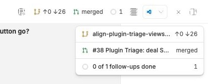
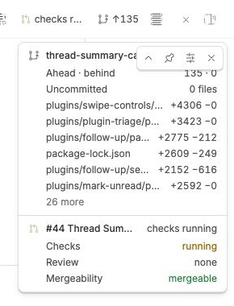

# Thread Summary

A thread's header tells you its title. It does not tell you that its branch is
behind main, that its pull request has failing checks, or that two of its
follow-ups are still open. Thread Summary puts all of that in one card under
the thread header, and the most urgent of it beside the button as chips.

The card is the second surface for *complications*: small values one plugin
publishes about a thread and another draws (`lib/complications.ts`). Thread
Badges draws them on sidebar rows; this draws every one of them for the thread
in view. It also publishes two of its own, Git and the pull request, which
Thread Badges can draw too.

## Install

```sh
bb plugin install "git:https://github.com/matthewdias/bb-plugins.git@*" \
  --subdirectory plugins/thread-summary --tag-prefix thread-summary/
```

With `--tag-prefix`, the range `*` resolves to the newest
`thread-summary/vX.Y.Z` tag, so this line stays correct as the plugin releases
and `bb plugin update` follows it.

## What it does





The `screenshots/` directory holds the frames for a store listing, taken from a
live bb 0.45 window: desktop compact, expanded, the controls on hover, chips
off, and the phone drawer at half and full height.

### The card

The header button opens a card, top right of the thread pane and under the
header, 260px wide. One block per provider with something to say, Git and the
pull request first, then the rest in the order they registered. A block's
first line is the value's glyph in its tone, its headline (`detail.title`, or
the label), then its text; the provider's name is the line's tooltip and
accessible name. A value with a `fraction` draws as a ring.

Two modes, switched from the card and remembered per device: **compact** shows
headline lines only; **expanded** adds each value's detail rows, eight at most
and then "N more".

The controls — mode, pin, settings and close — sit in the card's top-right
corner, inside it, and show only while the card is hovered or has keyboard
focus.

**Pin** is one setting per device. Pinned, the card stays open on every thread,
through thread switches and clicks elsewhere. Unpinned, Escape, a click outside
or a thread switch closes it. A click inside one of bb's own portaled overlays
— a menu, a popover, the file preview — is not "outside".

A split layout has a header per pane, and each gets its own card.

### The header

The button is always there. Beside it sit up to three **chips**, the thread's
worst values first: error, warning, running, info, success, default, with ties
in provider order. A chip is the glyph and its text; clicking one opens the
card. With chips off — or on a phone or a coarse pointer — the button shows a
dot in the worst tone instead, and no dot when every value is `default`.

### Phones and coarse pointers

The card becomes a bottom drawer. Half height is compact; dragging its top edge
up to full height is expanded, and the toggle on that edge does the same. Swipe
down or tap outside to close. Pin does not apply.

### Providers it publishes

| Id | Glyph, label, text, tone | Detail | Opens |
| --- | --- | --- | --- |
| `thread-summary/git` | `GitBranch`; `<branch> → <base>`; `↑ahead`, plus `↓behind` when non-zero; `warning` when behind or with uncommitted changes | ahead · behind, uncommitted N files, then the files with the most changed lines (branch and working tree summed per path), each opening in the thread's workspace | — |
| `thread-summary/pull-request` | `GitPullRequest`; `#<n> <title>`; text and tone from bb's `attention` | checks, review, mergeability, and auto-merge or the merge queue when set | the pull request |

Pull-request tones: failed checks and conflicts are `error`; pending checks and
the merge queue are `running`; changes requested and blocked are `warning`;
review requested is `info`; ready to merge and merged are `success`; draft,
closed and a quiet open PR are `default`.

Each provider answers only the threads some surface wants. Git is read from
`environments.status` against the environment's merge-base branch: again when
a card opens for the thread, every 20 seconds while it stays open, and when the
thread's agent goes from busy to idle. bb sends a plugin no turn or diff events
of its own, so that transition, read from the sidebar's live thread list, is
the signal. The pull request comes from `experimental_useSidebarThreadPullRequest`,
which owns its polling.

## The shapes this surface defines

Protocol v1 reserves `detail` and `open` for the first surface that draws them
and passes both through unchecked. This is that surface, and it checks them
before drawing:

```ts
detail?: { title?: string; rows: { label: string; value?: string; tone?: string; icon?: string; href?: string; file?: string }[] }
open?: { href: string }
```

- **`href`** (a row's, or `open`): an http(s) URL, or an app path with exactly
  one leading `/`. Any whitespace, control character or backslash is refused
  first, since a browser strips the one and reads the other as a slash —
  `/\t/x` and `/\x` both become `//x`. Drawn as a real link, so copy and
  middle-click work.
- **`file`**: a path relative to the thread's workspace. Absolute paths, drive
  letters and any `..` segment are refused. Drawn as bb's file link.

A field that fails is dropped, not its row.

## Settings

- **Show chips in the thread header** — on by default.
- **Hidden providers** — every live thread provider, one checkbox each. Stored
  in this plugin's storage behind an RPC, because providers are discovered in
  the app after bb's settings are declared.

## Why the card is rendered by the header action

The card is portaled to the document body, but rendered by the header action
rather than an app overlay. bb's file links work only beneath a thread's own
surface: from an `experimental_appOverlay`, `experimental_FileLink` renders an
anchor that opens nothing, and `experimental_openFilePreview` returns `false`.
React context follows a portal back to where it was rendered, so a card the
header action portals keeps them working.

## Development

```sh
npm test --workspace=bb-plugin-thread-summary
npm run typecheck --workspace=bb-plugin-thread-summary
cd plugins/thread-summary && bb plugin install . && bb plugin dev .
```

`lib/complications.ts` is a vendored copy of protocol v1; edit it only together
with every other copy, as `scripts/check-vendored.mjs` enforces.
