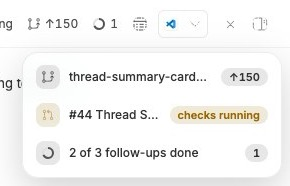
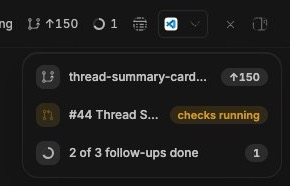

# Thread Summary

A thread's header tells you its title. It does not tell you that its branch is
behind main, that its pull request has failing checks, or that two of its
follow-ups are still open. Thread Summary puts all of that in one card under
the thread header, and the most urgent of it beside the button as chips.

The card is the second surface for *complications*: small values one plugin
publishes about a thread and another draws (`lib/complications.ts`). Thread
Badges draws them on sidebar rows; this draws every one of them for the thread
in view. It also publishes two of its own, Git and the pull request, which
Thread Badges can draw too.

## Install

```sh
bb plugin install "git:https://github.com/matthewdias/bb-plugins.git@*" \
  --subdirectory plugins/thread-summary --tag-prefix thread-summary/
```

With `--tag-prefix`, the range `*` resolves to the newest
`thread-summary/vX.Y.Z` tag, so this line stays correct as the plugin releases
and `bb plugin update` follows it.

## What it does





The `screenshots/` directory holds the frames for a store listing, taken from a
live bb 0.45 window: the desktop card in light and dark, the phone header with
its dot in place of chips, and the phone drawer.

### The card

The header button shows a card, top right of the thread pane and under the
header, 260px wide; press it again to hide it. One block per provider with
something to say, Git and the pull request first, then the rest in the order
they registered. A block's first line is the value's glyph in its tone, its
headline (`detail.title`, or the label), then its text; the provider's name is
the line's tooltip and accessible name. A value with a `fraction` draws as a
ring. A provider that supplies detail rows gets them under its line, eight at
most and then "N more"; Git and the pull request supply none, since bb's own
Info panel already shows their detail and can act on it.

The card has no controls of its own. Whether it shows is remembered on this
device: it stays through thread switches and reloads, in every pane, until the
button hides it. A click elsewhere does not hide it. Opened from the keyboard,
the card takes focus, so Tab reaches its links next; opened with the mouse,
focus stays where it was. Escape from inside the card hides it and hands focus
back to the button.

The card is a glass panel: bb's popover colour at 70% over an 18px blur of
the conversation behind it, a 16px radius, a hairline border and a soft
shadow. Where the browser cannot blur, or you ask your system for less
transparency, it is the plain popover. Lines are separated by space, not
rules; each glyph sits in a square tinted with its tone, and each value is a
pill in its tone (quiet values in a muted pill). Every tint comes from the
value's tone and bb's theme colours, so it follows light, dark and bb themes,
the same for every provider. The phone drawer keeps bb's own sheet behind the
same lines.

A split layout has a header per pane, and each gets its own card.

### The header

The button is always there. Beside it sit up to three **chips**, the thread's
worst values first: error, warning, running, info, success, default, with ties
in provider order. A chip is the glyph and its text, as wide as its text up to
112px; clicking one shows the card. bb gives a header control 256px. A chip
whose text is 8 characters or fewer — a count, `↑141 ↓26`, `merged` — never
shrinks, so it shows whole or not at all; a chip with longer text gives way,
cut to fit the room the others leave. If even the short chips cannot all fit,
the least urgent is left out whole. The button never moves. With chips off — or on a phone or a coarse pointer — the button shows a
dot in the worst tone instead, and no dot when every value is `default`.

### Phones and coarse pointers

The card becomes a bottom drawer. It fits its contents, up to 92% of the
screen, and scrolls inside past that. Its top edge holds the handle and a close
button, since its backdrop covers the header button. Drag it down past a
quarter of its height, tap outside, press Escape or close it, and focus goes
back to the header button; let go short of that quarter and it springs back.
Showing it is never remembered on a phone: it opens when asked and closes on a
thread switch.

### Providers it publishes

Each is one line, with no `detail`: bb's own Info panel shows the rest.

| Id | Glyph, label, text, tone | Opens |
| --- | --- | --- |
| `thread-summary/git` | `GitBranch`; `<branch> → <base>`; `↑ahead`, plus `↓behind` when non-zero; `warning` when behind or with uncommitted changes | — |
| `thread-summary/pull-request` | `GitPullRequest`; `#<n> <title>`; the worst state as a phrase, and its tone, from bb's `attention` | the pull request |

Pull-request tones: failed checks and conflicts are `error`; pending checks and
the merge queue are `running`; changes requested and blocked are `warning`;
review requested is `info`; ready to merge and merged are `success`; draft,
closed and a quiet open PR are `default`.

Each provider answers only the threads some surface wants, and asks afresh
whenever one is wanted again. Git is read from `environments.status` against
the environment's merge-base branch — `environments.get` then the status, two
calls, four threads at a time at most: again when a card opens for the thread,
every 20 seconds while it stays shown, and when the thread's agent goes from busy
to idle. The environment is the sidebar's live one, so a thread that gets an
environment, or moves to another, is followed at once; only a thread the sidebar
does not list, such as an archived one, costs a `threads.get` as well. bb sends a plugin no turn or diff events
of its own, so that transition, read from the sidebar's live thread list, is
the signal. The pull request comes from `experimental_useSidebarThreadPullRequest`,
which owns its polling.

## The shapes this surface defines

Protocol v1 reserves `detail` and `open` for the first surface that draws them
and passes both through unchecked. This is that surface, and it checks them
before drawing:

```ts
detail?: { title?: string; rows: { label: string; value?: string; tone?: string; icon?: string; href?: string; file?: string }[] }
open?: { href: string }
```

- **`href`** (a row's, or `open`): an http(s) URL, or an app path with exactly
  one leading `/`. Any whitespace, control character or backslash is refused
  first, since a browser strips the one and reads the other as a slash —
  `/\t/x` and `/\x` both become `//x`. Drawn as a real link, so copy and
  middle-click work.
- **`file`**: a path relative to the thread's workspace. Absolute paths, any
  scheme or drive (a colon before the first `/`, so `file://` is out), any
  `..` segment, and any segment with whitespace at either end are refused —
  Windows strips a trailing space, so `a/.. /x` is `..` there. Drawn as bb's
  file link.

A field that fails is dropped, not its row.

## Settings

- **Show chips in the thread header** — on by default.
- **Hidden providers** — every live thread provider, one checkbox each. Stored
  in this plugin's storage behind an RPC, because providers are discovered in
  the app after bb's settings are declared.

## Why the card is rendered by the header action

The card is portaled to the document body, but rendered by the header action
rather than an app overlay. bb's file links work only beneath a thread's own
surface: from an `experimental_appOverlay`, `experimental_FileLink` renders an
anchor that opens nothing, and `experimental_openFilePreview` returns `false`.
React context follows a portal back to where it was rendered, so a card the
header action portals keeps them working.

## Development

```sh
npm test --workspace=bb-plugin-thread-summary
npm run typecheck --workspace=bb-plugin-thread-summary
cd plugins/thread-summary && bb plugin install . && bb plugin dev .
```

`lib/complications.ts` is a vendored copy of protocol v1; edit it only together
with every other copy, as `scripts/check-vendored.mjs` enforces.
